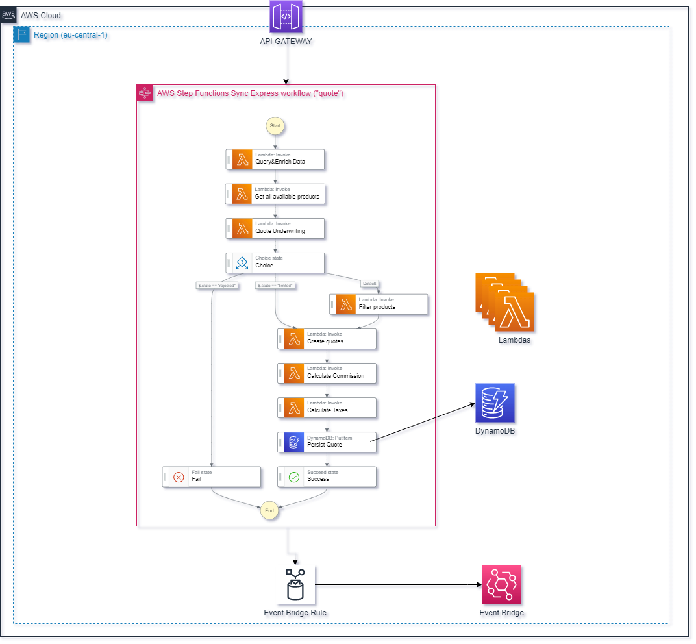

# Welcome to the infrastructure project

This folder hosts the AWS infrastructure for spinning up the StepFunctions, Lambdas etc.

## Useful commands

* `pnpm run build`   compile typescript to js
* `pnpm run watch`   watch for changes and compile
* `pnpm run test`    perform the jest unit tests
* `pnpm cdk deploy`      deploy this stack to your default AWS account/region
* `pnpm cdk destroy`      remove this stack
* `pnpm cdk diff`        compare deployed stack with current state
* `pnpm cdk synth`       emits the synthesized CloudFormation template
* `pnpm cdk-app`   runs infrastructure.ts (through ts-node, so no build necessary)

# What about multiple AWS Profiles?
All CDK commands accept the flag `--profile` to specify an AWS profile.

# HOWTO: Deploy the Stack

Normally, the Stack would only deploy *once* per account. To let developers experiment on their own, we augment the name of their current user from the Env Variables.
Thus a stack might look like `InfrastructureStack-lukas`, as its configured to set `InfrastructureStack-${process.env.USER}`.
Please be mindful of not wasting too much resources and destroy your respective stack after your tests with `pnpm cdk destroy`

## Initial business logic for MGA

The initial Step Functions workflow and corresponding infrastructure is depicted here:

Some key bullet points for implementing this:
* We will implement this infrastructure entirely in the AWS region `eu-central-1`.
* We assume for now, that all lambdas will be written in Typescript and built out of this monorepo.
* We use DynamoDB to store the quote data (data model to follow)
* We use a Step Functions Express Workflow
* On success, we want to generate an event in Event Bridge

## HOWTO: USE CREDENTIALS

Download & delete your access credentials from AWS Secrets Manager: https://eu-central-1.console.aws.amazon.com/secretsmanager/listsecrets?region=eu-central-1
